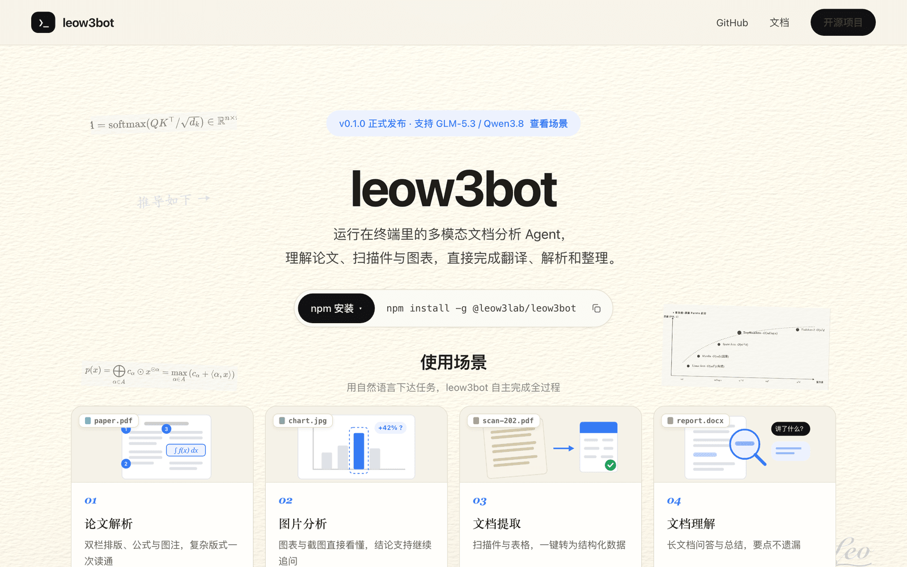

<div align="center">

# leow3bot

**连接智谱 BigModel，把任务交给终端——leow3bot 自主调用工具跑完剩下的事。**

[](https://leow3bot.com)

[](https://www.npmjs.com/package/@leow3lab/leow3bot)
[](https://github.com/yuanhechen/leow3bot/actions/workflows/ci.yml)
[](LICENSE)

**[官网与场景演示](https://leow3bot.com)** · **[用户指南](docs/guide.md)** · **[贡献指南](AGENTS.md)**

TypeScript + ink 构建 · 全程流式输出

</div>

---

**你不该把时间花在「打开文件 → 复制 → 切窗口 → 粘贴 → 跑命令」的循环里。**

一句话描述任务，leow3bot 自主选择并组合工具完成：读写文件、执行命令、查看图片、联网搜索。

## 能做什么

| | |
|---|---|
| 📄 **多模态文档理解** | 论文、扫描件、图表、截图——PDF skill 自动分类：文字型提取为文本，扫描件渲染逐页识别 |
| 🔧 **工具自主编排** | 读取定位 → 精确替换 → 执行测试 → 分析报错 → 修复重跑，直到通过 |
| 🛡️ **权限管控** | 高危命令命中内置黑名单直接拒绝；`permissions.confirm` 按需配置执行前确认 |
| 🖼️ **视觉查看** | Ctrl-V 直接粘贴剪贴板截图提问，看图找 bug |
| 💬 **会话恢复** | 对话自动保存，`leow3bot -r` 完整续接上下文与工作目录 |
| 🧩 **skill 扩展** | 兼容 Claude 生态 `SKILL.md`，三个目录层级自动扫描加载 |

## 你说，它做

| 你说 | 它做 |
|---|---|
| 「这个仓库的入口在哪，梳理下结构」 | 浏览目录、阅读源码，给出结构总结 |
| 「跑下测试，挂了就修」 | 执行测试 → 分析报错 → 修改 → 重跑，直到通过 |
| 「看看这张截图哪有 bug」 | 视觉查看图片（Ctrl-V 粘贴剪贴板截图） |
| 「读一下这份 PDF」 | PDF skill 自动分类：文字型提取为文本，扫描件渲染逐页识别 |

完整命令表、快捷键、skill 配置见 **[用户指南](docs/guide.md)**。

## 三行跑起来

```bash
npm install -g @leow3lab/leow3bot
leow3bot        # 首次启动进入四步引导，答完即用
```

Node.js ≥ 20 · [智谱 BigModel API Key](https://open.bigmodel.cn)

## 贡献

改动一律走 PR：CI（`typecheck + test + build`，Node 20/22）必须全绿，Gemini Code Assist 按 [`.gemini/styleguide.md`](.gemini/styleguide.md) 自动初审。动代码前请先读 [AGENTS.md](AGENTS.md)。

---

<div align="center">

**v0.1.0 · 支持 GLM-5.3 / Qwen3.8 · Apache 2.0 开源**

[Apache License 2.0](LICENSE) © 2026 yuanhechen

</div>
